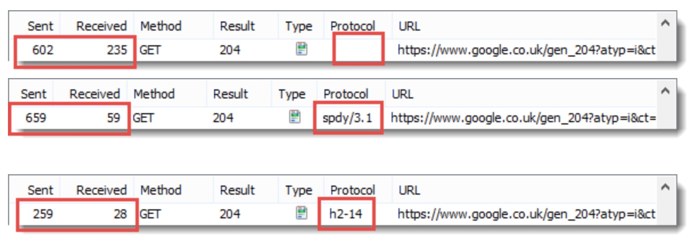

# HTML5

# CSS3

# Flex布局

# WebSocket

# Catch

# HTTP2

> HTTP/2 可以让我们的应用更快、更简单、更稳定 - 这几词凑到一块是很罕见的！HTTP/2 将很多以前我们在应用中**针对 HTTP/1.1 想出来的“歪招儿”一笔勾销**，把解决那些问题的方案内置在了传输层中。

HTTP/2 的目的是通过支持完整的请求与响应**复用**来减少延迟，通过有效**压缩 HTTP 标头字段**将协议开销降至最低，同时增加**对请求优先级和服务器推送**的支持。为达成这些目标，HTTP/2 还给我们带来了大量其他协议层面的辅助实现，例如新的流控制、错误处理和升级机制。

HTTP/2 **没有改动 HTTP 的应用语义**。HTTP 方法、状态代码、URI 和标头字段等核心概念一如往常。不过，HTTP/2 **修改了数据格式化（分帧）以及在客户端与服务器间传输的方式**, 通过新的分帧层向我们的应用**隐藏了所有复杂性**。因此，所有现有的应用都可以**不必修改**而在新协议下运行。

HTTP/2 引入了一个新的二进制分帧层，该层**无法与之前的 HTTP/1.x 服务器和客户端向后兼容**，因此协议的主版本提升到 HTTP/2。

**可观察到的唯一区别将是性能的提升和请求优先级、流控制与服务器推送等新功能的出现。**

## 历史

HTTP/2源于Google开发的SPDY协议, 随着协议的成熟以及各大浏览器厂商的支持, HTTP 工作组以它为基础开始制定HTTP/2协议.

- 2012 年 3 月：征集 HTTP/2 建议
- 2012 年 11 月第一个 HTTP/2 草案（基于 SPDY）
- 2014 年 8 月：HTTP/2 草案 17 和 HPACK 草案 12 发布
- 2014 年 8 月：工作组最后一次征集 HTTP/2 建议
- 2015 年 2 月：IESG 批准 HTTP/2 和 HPACK 草案
- 2015 年 5 月：RFC 7540 (HTTP/2) 和 RFC 7541 (HPACK) 发布
- 2015年9月，Google 宣布了计划，移除对SPDY的支持，拥抱 HTTP/2，并将在Chrome 51中生效。

## 兼容情况

## 实现原理

早期版本的 HTTP 协议的设计初衷主要是**实现要简单**, 实现简单是以**牺牲应用性能为代价**的： HTTP/1.x 客户端需要**使用多个连接才能实现并发和缩短延迟**；HTTP/1.x **不会压缩请求和响应标头**，从而导致不必要的网络流量；HTTP/1.x **不支持有效的资源优先级**，致使底层 TCP 连接的利用率低下；等等。

在HTTP/1.x协议下, 除了设计和编码问题外, 最主要的优化方式就是: 
- 减少请求数 - 包括合并文件/雪碧图/利用缓存/长轮训机制等.
- 降低传输数据量 - 包括图片压缩/JS和CSS文件混淆压缩/JSON传输格式等.

> https://hpbn.co/optimizing-application-delivery/#optimizing-for-http1x

HTTP/2 通过支持**标头字段压缩**和在**同一连接上进行多个并发交换**，让应用更有效地利用网络资源，减少感知的延迟时间。具体来说，它可以对同一连接上的请求和响应消息进行交错发送并为 HTTP 标头字段使用有效编码。 HTTP/2 还允许**为请求设置优先级，让更重要的请求更快速地完成**，从而进一步提升性能。出台的协议对网络更加友好，因为与 HTTP/1.x 相比，可以使用更少的 TCP 连接。

这意味着**与其他流的竞争减小，并且连接的持续时间变长，这些特性反过来提高了可用网络容量的利用率**。 最后，HTTP/2 还可以通过**使用二进制消息分帧对消息进行更高效的处理**。

### 二进制分帧层

HTTP/2 所有性能增强的**核心在于新的二进制分帧层**，它定义了如何封装 HTTP 消息并在客户端与服务器之间传输。

HTTP/1.x 协议**以换行符作为纯文本的分隔符**，而 HTTP/2 将所有传输的**信息分割为更小的消息和帧，并采用二进制格式对它们编码**。

客户端和服务器为了相互理解，**都必须使用新的二进制编码机制**：HTTP/1.x 客户端无法理解只支持 HTTP/2 的服务器

> NGINX 1.9.5版本开始支持HTTP/2, 开启之后, 如果客户端不支持, 会自动降级到HTTP/1.x
> https://www.nginx.com/blog/nginx-1-9-5/
> https://ice.gs/2017/06/17/nginx-qi-yong-http2-2/

### 数据流、消息和帧

新的二进制分帧机制改变了客户端与服务器之间**交换数据的方式**。

- 数据流：已建立的连接内的**双向字节流**，可以承载**一条或多条**消息。
- 消息：与逻辑请求或响应消息对应的**完整的一系列帧**。
- 帧：HTTP/2 通信的**最小单位**，每个帧都包含帧头，至少也会标识出当前帧所属的数据流。

概念的关系总结如下：

- 所有通信都在**一个 TCP 连接**上完成，此连接可以承载**任意数量**的双向数据流。
- 每个数据流都有一个**唯一的标识符**和**可选的优先级信息**，用于承载双向消息。
- 每条消息都是一条**逻辑 HTTP 消息（例如请求或响应），包含一个或多个帧**。
- 帧是最小的通信单位，承载着特定类型的数据，例如 HTTP 标头、消息负载，等等。 来自不同数据流的**帧可以交错发送**，然后再**根据每个帧头的数据流标识符重新组装**。

**简言之，HTTP/2 将 HTTP 协议通信分解为二进制编码帧的交换，这些帧对应着特定数据流中的消息。所有这些都在一个 TCP 连接内复用。这是 HTTP/2 协议所有其他功能和性能优化的基础。**

### 请求与响应复用

在 HTTP/1.x 中，如果客户端要想发起**多个并行请求以提升性能，则必须使用多个 TCP 连接**（请参阅使用多个 TCP 连接）。这是 HTTP/1.x 交付模型的直接结果，该模型可以保证**每个连接每次只交付一个响应**（响应排队）。更糟糕的是，这种模型也会导致**队首阻塞，从而造成底层 TCP 连接的效率低下**。

HTTP/2 中新的二进制分帧层突破了这些限制，实现了完整的请求和响应复用：**客户端和服务器可以将 HTTP 消息分解为互不依赖的帧，然后交错发送，最后再在另一端把它们重新组装起来。**

### 数据流优先级

HTTP/2 标准允许每个数据流都有一个**关联的权重和依赖关系**：
- 可以向每个数据流分配一个介于 1 至 256 之间的整数。
- 每个数据流与其他数据流之间可以存在显式依赖关系。

数据流依赖关系和权重的组合**让客户端可以构建和传递“优先级树”，表明它倾向于如何接收响应**。反过来，**服务器可以使用此信息通过控制 CPU、内存和其他资源的分配设定数据流处理的优先级**，在资源数据可用之后，带宽分配可以确保将高优先级响应以最优方式传输至客户端。

共享相同父项的数据流（即，同级数据流）应按其权重比例分配资源。 例如，如果数据流 A 的权重为 12，其同级数据流 B 的权重为 4，那么要确定每个数据流应接收的资源比例，请执行以下操作：

1. 将所有权重求和：4 + 12 = 16
2. 将每个数据流权重除以总权重：A = 12/16, B = 4/16因此，数据流 A 应获得四分之三的可用资源，数据流 B 应获得四分之一的可用资源；**数据流 B 获得的资源是数据流 A 所获资源的三分之一**。
3. 数据流 A 和数据流 B 都没有指定父依赖项，**依赖于显式“根数据流”**；A 的权重为 12，B 的权重为 4。因此，根据比例权重：数据流 B 获得的资源是 A 所获资源的三分之一。
4. 数据流 D 依赖于根数据流；C 依赖于 D。因此，D 应先于 C 获得完整资源分配。**权重不重要，因为 C 的依赖关系拥有更高的优先级。**
5. 数据流 D 应先于 C 获得完整资源分配；C 应先于 A 和 B 获得完整资源分配；数据流 B 获得的资源是 A 所获资源的三分之一。
6. **数据流 D 应先于 E 和 C 获得完整资源分配；E 和 C 应先于 A 和 B 获得相同的资源分配；A 和 B 应基于其权重获得比例分配。**

> 注：数据流依赖关系和权重表示传输优先级，而不是要求，因此不能保证特定的处理或传输顺序。优先级较高的资源受到阻止时，不要阻止服务器处理优先级较低的资源。

### 每个来源一个连接

HTTP/2 不再依赖多个 TCP 连接去并行复用数据流, 因此，所有 HTTP/2 连接都是**永久的**，而且**仅需要每个来源一个连接**，随之带来诸多性能优势。

**大多数 HTTP 传输都是短暂且急促的**，而 TCP 则针对长时间的批量数据传输进行了优化。 通过重用相同的连接，HTTP/2 既可以更有效地利用每个 TCP 连接，也可以显著降低整体协议开销。

> 注：连接数量减少对提升 HTTPS 部署的性能来说是一项特别重要的功能：可以减少开销较大的 TLS 连接数、提升会话重用率，以及从整体上减少所需的客户端和服务器资源。

### 流控制

流控制是一种阻止发送方向接收方发送大量数据的机制，**以免超出后者的需求或处理能力**

> 例如，客户端可能请求了一个具有较高优先级的大型视频流，但是用户已经暂停视频，客户端现在希望暂停或限制从服务器的传输，以免提取和缓冲不必要的数据。
> 再比如，一个代理服务器可能具有较快的下游连接和较慢的上游连接，并且也希望调节下游连接传输数据的速度以匹配上游连接的速度来控制其资源利用率；等等。

HTTP/2 提供了一组简单的构建块，这些构建块允许客户端和服务器实现其自己的数据流和连接级流控制：

- 流控制具有**方向性**。每个接收方都可以根据自身需要选择为每个数据流和整个连接设置任意的窗口大小。
- 流控制**基于信用**。每个接收方都可以公布其初始连接和数据流流控制窗口（以字节为单位），每当发送方发出 DATA 帧时都会减小，在接收方发出 WINDOW_UPDATE 帧时增大。
- 流控制**无法停用**。建立 HTTP/2 连接后，客户端将与服务器交换 SETTINGS 帧，这会在两个方向上设置流控制窗口。流控制窗口的默认值设为 65,535 字节，但是接收方可以设置一个较大的最大窗口大小（2^31-1 字节），并在接收到任意数据时通过发送 WINDOW_UPDATE 帧来维持这一大小。
- 流控制为**逐跃点控制**，而非端到端控制。即，可信中介可以使用它来控制资源使用，以及基于自身条件和启发式算法实现资源分配机制。

### 服务器推送

服务器可以对一个客户端请求发送多个响应。 换句话说，除了对最初请求的响应外，服务器还可以**向客户端推送额外资源**

### 标头压缩

每个 HTTP 传输都承载一组标头，这些标头**说明了传输的资源及其属性**。 在 HTTP/1.x 中，此元数据始终以**纯文本形式**，通常会给每个传输增加 500–800 字节的开销。如果使用 **HTTP Cookie，增加的开销有时会达到上千字节。**

HTTP/2 使用 **HPACK 压缩格式压缩请求和响应标头元数据**，这种格式采用两种简单但是强大的技术：

- 这种格式支持通过静态 Huffman 代码对传输的标头字段进行编码，从而**减小了各个传输的大小**。
- 这种格式要求客户端和服务器同时维护和更新一个包含之前见过的标头字段的索引列表

## 性能对比

> http://blog.httpwatch.com/2015/01/16/a-simple-performance-comparison-of-https-spdy-and-http2/

### 请求大小

HTTP/2 因为采用了**HPACK算法**, 其压缩后的体积更小.

### 响应大小

- 图片 - 没有明显的大小变化

- 文本 - SPDY的压缩结果更好, 但是原因是**Google服务器为文本资源的数据框添加了填充, 用来模糊frame内容的确切大小，缓解HTTP内的特定攻击。**

### 连接数

**SPDY & HTTP/2**对每个域名仅建立一个永久连接, 避免重复的TCP连接.

- HTTP/1.x

- SPDY

- HTTP/2

### 页面加载时间

- HTTP/1.x

- SPDY

- HTTP/2

> https://zh.wikipedia.org/wiki/HTTP/2
> https://developers.google.com/web/fundamentals/performance/http2/?hl=zh-cn
> https://docs.google.com/presentation/d/1r7QXGYOLCh4fcUq0jDdDwKJWNqWK1o4xMtYpKZCJYjM/edit?hl=zh-cn#slide=id.p19
